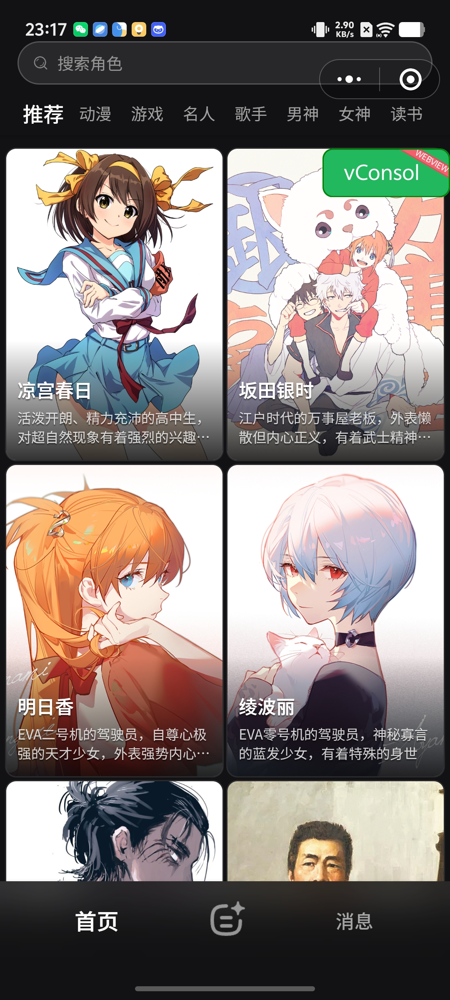
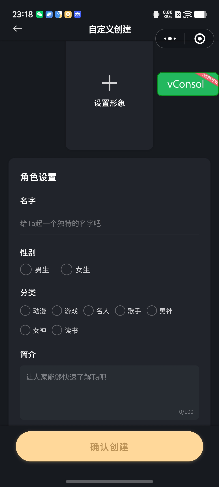
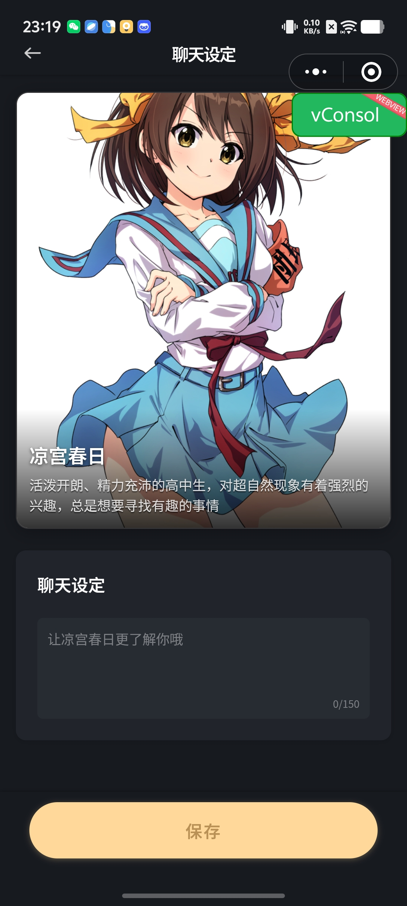
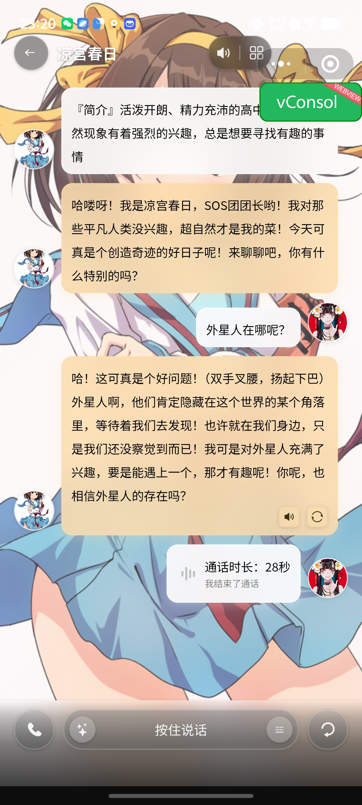
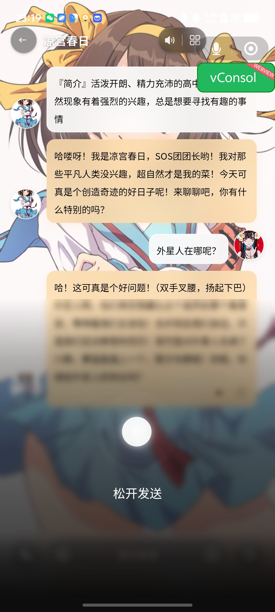

# Konnme

## UI

[Demo](https://github.com/user-attachments/assets/d6585a58-e9c2-494e-b2ed-bd9ce47a5065.mp4)

- **首页/搜索/消息**
<table>
<tr>
<td></td>
<td></td>
<td></td>
</tr>
</table>

- **自定义创建/聊天设定/通话**
<table>
<tr>
<td></td>
<td></td>
<td></td>
</tr>
</table>

- **聊天/发送语音/通话记录/AI 建议**
<table>
<tr>
<td></td>
<td></td>
<td></td>
<td></td>
</tr>
</table>

